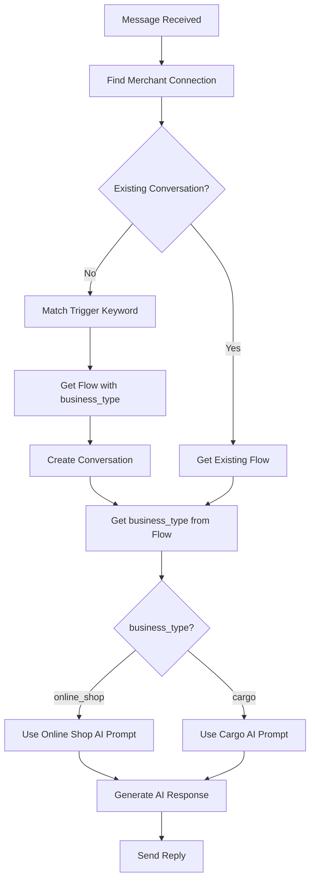

# Facebook Auto-Reply Business Type Enhancement

## Problem

You currently have a working AI-powered Facebook auto-reply system, but it lacks **business type distinction**. You want to support two specific business types:
1. **Online Shop** - Product orders, inventory queries, payment methods
2. **Cargo/Shipping** - Tracking, rates, delivery areas, package details

## Current System

Your existing implementation includes:
- ✅ Facebook webhook receiving messages
- ✅ OpenAI-powered conversation engine
- ✅ Automation flows with trigger keywords
- ✅ Automatic order creation
- ✅ Template-based and AI-based replies

**Key Files:**
- [webhook.ts](file:///d:/all%20in%20one/backend/src/controllers/webhook.ts) - Handles incoming Facebook messages
- [conversationEngine.ts](file:///d:/all%20in%20one/backend/src/services/conversationEngine.ts) - AI response generation
- [autoReply.controller.ts](file:///d:/all%20in%20one/backend/src/controllers/autoReply.controller.ts) - Template management

## Proposed Changes

### Database Schema

#### [MODIFY] automation_flows table
Add `business_type` field to distinguish between 'online_shop' and 'cargo'

```sql
ALTER TABLE automation_flows 
ADD COLUMN business_type VARCHAR(50) DEFAULT 'online_shop';
```

---

### Backend Services

#### [MODIFY] [conversationEngine.ts](file:///d:/all%20in%20one/backend/src/services/conversationEngine.ts)
- Add business type parameter
- Create business-specific AI prompts
- Extract different data fields based on business type

**Online Shop AI Prompt:**
```
You are a helpful online shop assistant. Extract order information:
- product_code or product_name
- quantity
- delivery_address
- phone_number
- payment_method_preference (COD, bank_transfer, etc.)
```

**Cargo/Shipping AI Prompt:**
```
You are a cargo/shipping assistant. Extract shipment information:
- package_type (document, parcel, box)
- weight (kg)
- pickup_address
- delivery_address
- phone_number
- delivery_urgency (standard, express)
```

#### [MODIFY] [webhook.ts](file:///d:/all%20in%20one/backend/src/controllers/webhook.ts)
- Pass business_type from matched flow to conversation engine
- Handle business-specific order creation

---

### Pre-configured Automation Flows

#### [NEW] Migration script or seed data
Create default flows for both business types:

**Online Shop Flows:**
- Trigger: "order", "buy", "purchase" → Product ordering conversation
- Trigger: "price", "cost", "how much" → Pricing inquiries
- Trigger: "delivery", "shipping" → Delivery information
- Trigger: "payment" → Payment methods

**Cargo Flows:**
- Trigger: "track", "tracking" → Package tracking
- Trigger: "ship", "send package" → New shipment inquiry
- Trigger: "rate", "price", "cost" → Shipping rates
- Trigger: "areas", "coverage", "locations" → Delivery coverage

---

### Configuration

#### [MODIFY] [.env](file:///d:/all%20in%20one/backend/.env)
No changes needed - OpenAI key already configured

---

## Implementation Details

### 1. Business Type Detection Flow



### 2. Enhanced Data Extraction

**Online Shop Data Structure:**
```typescript
{
  product_code?: string;
  product_name?: string;
  quantity?: number;
  delivery_address?: string;
  phone_number?: string;
  payment_method?: string;
  order_complete: boolean;
}
```

**Cargo Data Structure:**
```typescript
{
  package_type?: string;
  weight?: number;
  pickup_address?: string;
  delivery_address?: string;
  phone_number?: string;
  delivery_urgency?: string;
  shipment_complete: boolean;
}
```

### 3. AI Prompt Templates

Located in `conversationEngine.ts`:

```typescript
const BUSINESS_PROMPTS = {
  online_shop: `You are a friendly online shop assistant for a Facebook page.
    
Your goal is to help customers place orders naturally.

Extract the following information from the conversation:
- product_code or product_name: What they want to buy
- quantity: How many items
- delivery_address: Where to deliver
- phone_number: Contact number
- payment_method: COD, bank transfer, etc.

Respond naturally and ask for missing information one at a time.
Return strict JSON:
{
  "reply": "your friendly message here",
  "data": {},
  "order_complete": true/false
}`,

  cargo: `You are a helpful cargo/shipping assistant for a Facebook page.

Your goal is to help customers send packages.

Extract the following information:
- package_type: document, parcel, box, etc.
- weight: Weight in kg
- pickup_address: Where to pick up
- delivery_address: Where to deliver
- phone_number: Contact number  
- delivery_urgency: standard or express

Respond naturally and ask for missing information one at a time.
Return strict JSON:
{
  "reply": "your friendly message here",
  "data": {},
  "shipment_complete": true/false
}`
};
```

## Verification Plan

### Database Testing
1. Run migration to add `business_type` column
2. Create test automation flows for both business types
3. Verify flows are stored correctly

### Functional Testing  
1. Send "order" message → Should trigger online shop flow
2. Send "ship" message → Should trigger cargo flow
3. Verify AI uses correct prompts for each type
4. Confirm data extraction matches business type
5. Check orders/shipments are created with correct fields

### Integration Testing
1. Test full conversation flow for online shop order
2. Test full conversation flow for cargo shipment
3. Verify AI maintains context across messages
4. Confirm completion detection works for both types

## Next Steps

After implementation:
1. **Frontend Dashboard** - Add business type selector when creating automation flows
2. **Analytics** - Track conversions per business type
3. **Templates** - Create quick-reply buttons for common responses
4. **Multilanguage** - Support for Myanmar/Burmese language (I noticed your screenshot has Myanmar text!)
